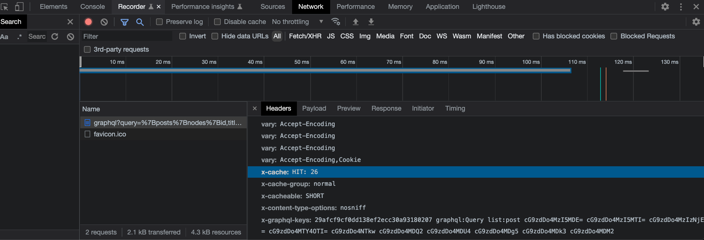
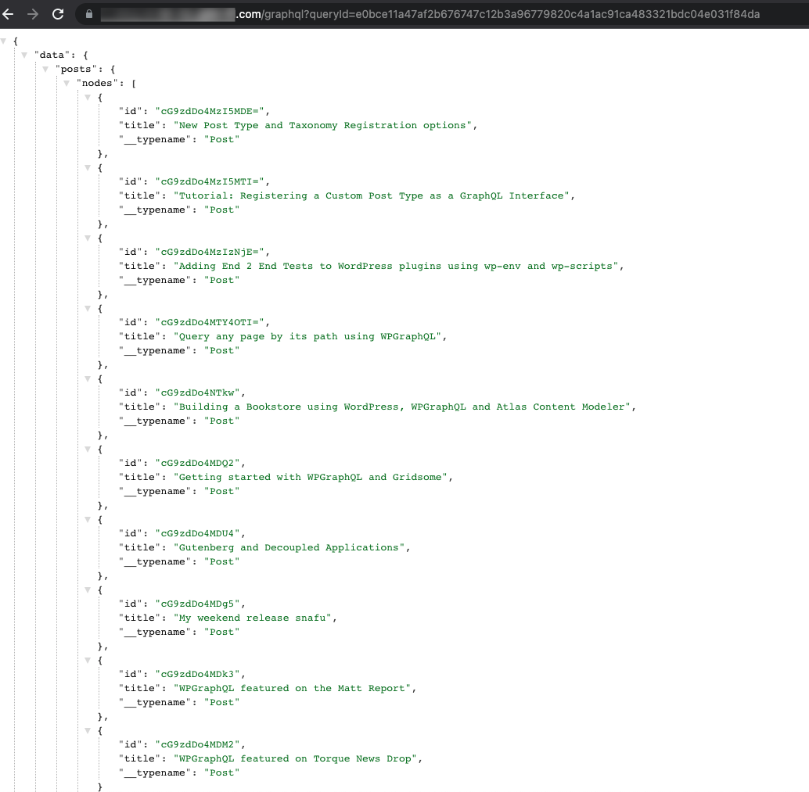
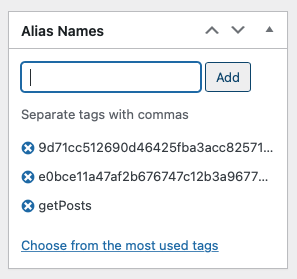
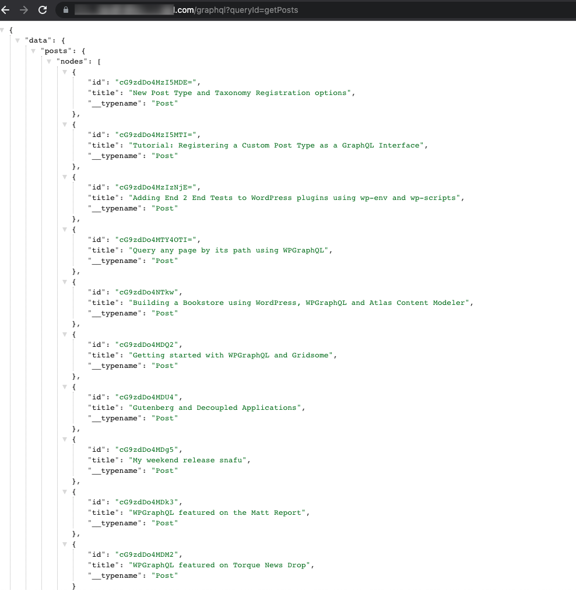
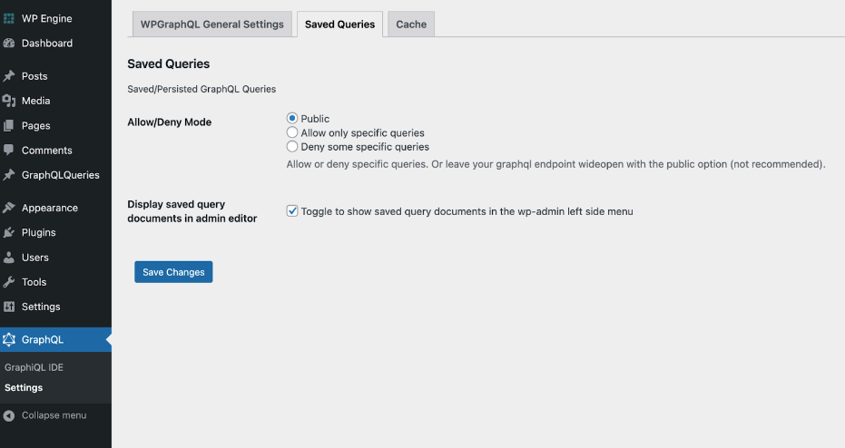
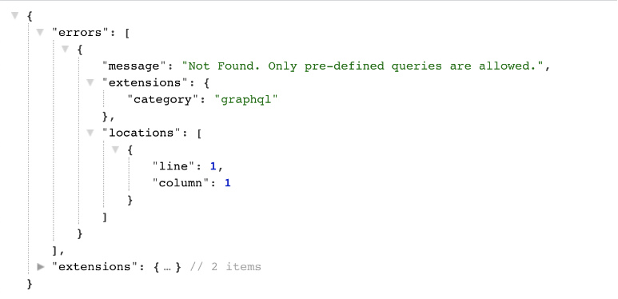
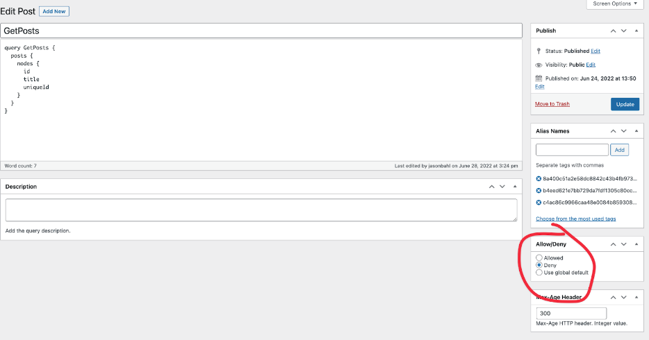
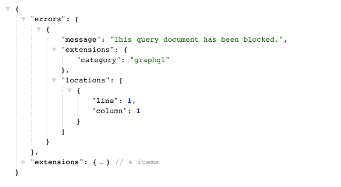

# WPGraphQL Smart Cache

This plugin provides support for caching and cache invalidation of WPGraphQL Queries.

This plugin works best when your WordPress install is on a [supported host](#supported-hosts).

----

- [Quick Start](#quick-start)
    - [Install & Activate](#install--activate)
- [Plugin Overview](#overview)
    - [Performance Issues](#performance-issues)
    - [Solving WPGraphQL Performance Problems](#solving-wpgraphql-performance-problems)
- [Caching](#caching):
    - [Object Cache](#object-cache)
    - [Network Cache (recommended)](#network-cache-recommended)
    - [Cache Invalidation](#cache-invalidation)
- [Extending](#extending)
- [FAQ & Troubleshooting](#faq--troubleshooting)
- [Local Development & Contributing](./docs/development.md)

----

## 🚀 Quick Start

_**NOTE:** Some details in this quick start guide assume you are using a WordPress site hosted on WP Engine and have already [installed and activated](#install--activate) the plugin. ([Sign up for a free WP Engine Sandbox Account](https://wpengine.com/atlas))._

### 👩‍💻 Execute a GraphQL Query (as an HTTP GET request)

Using a browser that is not authenticated to your WordPress site (or an incognito window), execute a GraphQL query as an HTTP GET request by visiting a url for a GraphQL query in the browser, like so (replacing the domain with your domain): `https://${yourdomain.com}/graphql?query={posts{nodes{id,title,uri}}}`

### 🧐 Inspect the Headers

Inspect the headers using your browser developer tools Network tab.

See an `x-cache` header with either a `MISS` value or a `Hit: #` value. The hit is the number of times the cached response has been served. The cache hits are returned from the network cache layer, instead of executing in WordPress.

Refresh the browser a few times and see the `x-cache: Hit: #` count increase.

### 📝 Edit Some Content

In another browser (or incognito window), login to your WordPress dashboard.

Edit the title of your most recent post (add a period to the title, for example) and click update.

### 🥳 Verify the Cache was Purged

Refresh the browser tab with the query and inspect the headers and the JSON response.

The response should have your updated title, and the `x-cache` header should be a `MISS`.

You just witnessed the power of WPGraphQL Smart Cache!

GraphQL responses are served from a cache and WPGraphQL Smart Cache tracks events (publishing, updating, deleting content, etc) and purges appropriate cache(s) in response to said events!

### 💸 Profit

To learn more about the plugin, continue reading the docs below.

----

### Install & Activate

To start using WPGraphQL Smart Cache, download the .zip of the plugin from the [latest release](https://github.com/wp-graphql/wp-graphql-smart-cache/releases/latest).

Upload the .zip to your WordPress install under "Plugins > Add New".

Activate the plugin.

----

## Overview

WPGraphQL has essentially become the standard when it comes to building headless WordPress experiences.

The flexibility and tooling around GraphQL is attractive, but it can come at a cost.

## Performance Issues

_"The fastest code is the code which does not run" - [Robert Galanakis](https://daveredfern.com/no-code/)_

----

WPGraphQL is optimized for run-time performance by using [DataLoader](https://www.wpgraphql.com/docs/wpgraphql-vs-wp-rest-api#dataloader-and-the-n1-problem) methods and other techniques to reduce run time execution cost, but the fact is that WPGraphQL is built on top of WordPress and respects the WordPress application layer – including actions, filters, authentication rules, and the WordPress database structure.

This means that anytime a WPGraphQL request is executed against WordPress (much like any type of request made to WordPress) there is a cost, and the cost can sometimes be problematic.

One of the fastest ways to load WordPress, is to prevent WordPress from being loaded at all!

This is no different for WPGraphQL.

And this is where WPGraphQL Smart Cache comes in.

WPGraphQL Smart Cache has integrations with a multiple layers of caching to provide users of WPGraphQL with both fast and accurate data managed in WordPress.

The over-simplification of WPGraphQL Smart Cache, is to capture the results of GraphQL Requests, store the response in a cache, and use the cached response for future requests instead of executing the query and all of its resolvers at each request.

Below we will discuss different methods of caching, how they each play into the bigger picture with WPGraphQL and how WPGraphQL Smart Cache works with them.

## Network Cache with GET REQUESTS (recommended)

For many years, managed WordPress hosts have sped up WordPress by using network-level page caching and serving WordPress pages to users from a cache, preventing the WordPress application itself from being executed to build the page for most requests.

For example, when you host your WordPress website with [WP Engine](https://wpengine.com/atlas), when a visitor visits your website, the first visitor will execute WordPress to build the page, then the page is stored in Varnish cache and subsequent users are served the cached page and WordPress itself is not loaded for those users.

WPGraphQL Smart Cache was built to work in environments, such as WP Engine, that have a network caching layer that caches requests via URL.

Below, we’ll look at how WPGraphQL Smart Cache works with network caching layers.

Because the network cache & cache invalidation strategy requires specific implementation by the host, network caching + invalidation will currently only work on [supported hosts](#supported-hosts).

## GET Requests

To benefit the most from WPGraphQL Smart Cache, you will want to use HTTP GET requests when fetching public data, and you will need to be on a [supported WordPress host](#supported-hosts) such as [WP Engine](https://wpengine.com/atlas).

When making HTTP GET requests to the WPGraphQL Endpoint, the first request for a particular query will be a Cache Miss in the network cache and will be passed to WordPress for execution.

The response will be cached and subsequent requests for the same query (from any client) will be served from teh cache and the WordPress server won't be loaded or tasked with executing.

This significantly reduces the load on your WordPress server, and significantly increases the speed of the API responses.

### GET Requests In Action

Visit the following URL in your browser: [https://content.wpgraphql.com/graphql?query={posts{nodes{id,title}}}](https://content.wpgraphql.com/graphql?query={posts{nodes{id,title}}})

If you inspect the "Network" tab in your browser's developer tools, you should see either an `X-Cache: MISS` header or a `X-Cache: Hit #` header, showing the number of times this query has been served from cache.

**X-Cache: MISS**

Below is a screenshot of a Cache Miss. Here, we see the `x-cache: MISS` header.

This means the request was passed through the network cache to WordPress for execution.

The total response time for the cache miss was ~520ms.


**X-Cache: HIT 26**

After refreshing the browser 26 times, I now see the header `x-cache: HIT 26`.

This means that the request was served from the network cache (in this case Varnish) and was not passed through to WordPress for execution.

This means that the WordPress server didn't experience any load from the 26 refreshes.

Your results may vary, but for me, the total response time for the cache hit was ~110ms, nearly 5x faster than the cache miss!

_Ideally, we'll be able to work with hosts to serve these cache hits even faster!_



### GET Query String Limitations?

One concern you might have with making GraphQL requests via HTTP GET is limitations around Query String Length.

GraphQL Queries can get quite long, so it's easy to push up against [max query string length limitations](https://stackoverflow.com/questions/812925/what-is-the-maximum-possible-length-of-a-query-string#answer-812962).

This takes us to the topic of "Persisted Queries", a feature bundled with the WPGraphQL Smart Cache plugin.

## Persisted Queries

In the GraphQL ecosystem, the term “Persisted Queries” refers to the idea that a GraphQL Query Document can be “persisted” on the server, and can be referenced via a Query ID.

There are several advantages to using Persisted Queries:

- Avoid query string limits
- Reduced upload cost per request (uploading large GraphQL query documents for each request has a cost)
- Ability to mark specific queries as allow/deny
- Ability to customize the cache-expiration time per query
- Future customizations at the individual query level

WP GraphQL Smart Cache provides support for "Persisted Queries" and plays nice with the [Apollo Persisted Query Link](https://www.apollographql.com/docs/react/api/link/persisted-queries/).

_**NOTE:** You can see the [implementation](https://github.com/wp-graphql/wpgraphql.com/blob/bab1429c0f25ba93ddd3dfba2e6998eec67b331a/src/plugins/PersistedQueriesPlugin.js) of the Apollo Persisted Queries link on WPGraphQL.com, a headless WordPress front-end powered by [NextJS](https://nextjs.org) and [FaustWP](https://www.npmjs.com/package/@faustwp/core)._

When WPGraphQL Smart Cache is active, there’s a non-public post type registered named “graphql_document”. This post type is used to “persist” query documents, associate them with unique IDs and maintain rules about the queries.

### Persisted Queries Admin UI

The Persisted Queries functionality of this plugin uses a private  “graphql_document” post_type. Since it’s a Post Type, we can make use of WordPress core ui’s.

**NOTE**: In the future we plan to have UIs more tightly integrated with the GraphiQL IDE, but for now, you can use the core WordPress UIs to interact with the saved GraphQL Documents.

There’s a setting under "GraphQL > Settings > Saved Queries" that lets you display the admin ui for saved queries.


With the UI set to be displayed, you will see a "GraphQL Documents" menu item.


From here, you can use the standard WordPress Admin User Interfaces to Create, Update and Delete GraphQL Documents.


Below is a look at the User Interface for editing a GraphQL Document.


From this screen you can add/update the following properties of a GraphQL Document:

- **title**: A reference name for the document. When using Automated Persisted Queries the title will be derived from the operation name(s) in the document, but the title can be updated to something you prefer for your own reference.
- **document**: The query string document
- **description**: A description of the document, for reference. For example, you might have been testing a document for a staging site and want to leave yourself a note here.
- **alias names / query IDs**: Alias Names can be used to query a document by queryId.
- **allow/deny**: Depending on the rules set at "GraphQL > Settings > Saved Documents", you can control whether a specific query should be allowed to execute (when the endpoint is otherwise locked down), or if a specific query should be denied execution, even though the endpoint is publicly queryable.
- **max-age header:** You can set a Cache expiration for this query, in seconds. This means that if no event occurs to purge the query will automatically purge when it hits this length of time. This can be useful for queries for data (such as custom plugin data) that might not be tracked in the Invalidation events.

#### Query IDs / Alias Names

One feature enabled by "Persisted Queries" is the ability to query documents by ID instead of by full query string.

When a GraphQL Document has been saved, it's assigned a unique ID that can be used to execute the query wihtout uploading the full document.

If the same query comes through with different formatting, a new ID is associated with the existing query.

For example, if I were to have the 2 following queries:

```graphql
{posts{nodes{id,title,__typename}}}
```

And:

```graphql
{
  posts {
    nodes {
      id
      title
      __typename
    }
  }
}
```

They would be stored once as a "GraphQL Document" in WordPress, because they're actually the same query, but because formatting is different, the client will have a different hash for each one, and we need to be able to resolve for each version of the hash the client has sent.

For example, if both of the above formatted versions of the query were sent over as persisted queries, I would see the following GraphQL Document persisted, with 2 Alias Names:


Either of these alias names can now be used to execute the document:




In addition to hashed Alias Names (IDs) being added when using Automated Persisted Queries, you can manually assign Alias Names to GraphQL Documents as well.

For example, I could add the alias name `getPosts` to the above GraphQL document:



Then I could use that Alias Name as the value of the `queryId` and execute the same document:



**NOTE:** Alias names must be unique across all GraphQL Documents. You cannot have 2 GraphQL Documents with the same alias name (manually entered or automatically generated).

#### Allow / Deny Rules

Saved GraphQL Documents can have allow/deny rules applied to them.

This goes hand in hand with the allow/deny rules setting under "GraphQL > Settings > Saved Queries".



If “Allow/Deny Mode” is left as “Public” then the WPGraphQL endpoint will be treated as a fully public endpoint (unless other code has been added to modify the endpoint)

If this setting is set to “Allow only specific queries” then the entire GraphQL Endpoint will be restricted from executing queries for public users, unless the query document is marked as “allowed”

For example, after setting the value to “Allow only specific queries” executing a new query will result with an error:



If the rule is set to "Deny some Specific Queries", then all queries will be allowed to execute as a fully public endpoint, with the exception of documents marked as "Deny".



If this query is executed now, an error will be returned.



#### Custom Max Age / Expiration Per Query

When creating / editing GraphQL Documents, you can set a custom max-age per document.

This max-age will be used as the max-age for the query to expire if another event has not already purged the cache.

This can be handy if you have queries that might not be invalidating properly based on changes to data in WordPress.

For example, currently queries for "Settings" are not invalidating when settings change. For these queries, they will invalidate (expire) when the max age has been hit.

## Object Cache (with HTTP POST requests)

_**NOTE:** When possible, we recommend taking advantage of [Network Caching and HTTP GET requests](#network-cache)_

If you’ve been using GraphQL for some time, there’s a good chance you use GraphQL via HTTP POST requests. It's the default HTTP method for many GraphQL APIs.

For most WordPress hosts, the [network cache](#network-cache) layer will **_NOT_** be in effect when using HTTP POST requests. That means HTTP POST requests to the WPGraphQL endpoint will bypass the network cache layer and will still be sent to WordPress for execution.

That means, if you want to take advantage of caching functionality for POST requests, you can use WPGraphQL Smart Cache's Object Cache functionality.

GraphQL Object Caching is a feature of the WPGraphQL Smart Cache plugin that, when enabled, will cache GraphQL responses in the object cache.

If your WordPress environment supports a persistent object cache (i.e. Redis, Memcached, etc) WPGraphQL Smart Cache will store responses to GraphQL queries in the object cache, and for future requests of the same query results will be returned from the cache instead of re-executing all the resolvers each time the request is made.

For WordPress environments that do not support persistent object cache, [transients](https://developer.wordpress.org/apis/handbook/transients/) will be used.

### Enabling WPGraphQL Smart Cache Object Caching

**NOTE:** Enabling this is only recommended if want some benefits of caching, but are not able to take advantage of [Network Caching](#network-cache-recommended).

With the WPGraphQL Smart Cache plugin active, a new "Cache" tab is added to the WPGraphQL Settings page.


From this settings page, clicking "Use Object Cache" will enable object caching.

In addition to enabling Object Caching, you can:

- set an expiration (in seconds) for caches to auto expire
- purge all object caches
- see the last time caches were purged

Setting the expiration, and purging caches will only take effect if Object Caching is enabled.


## GraphQL Cache Invalidation

One of the primary features of the WPGraphQL Smart Cache plugin is the cache invalidation.

Unlike RESTful APIs which are 1 enpdoint per resource type, GraphQL Queries can be constructed in nearly infinite ways, and can contain resources of many types.

Thus, caching and invalidating caches can be tricky.

This is where WPGraphQL Smart Cache really shines.

WPGraphQL Smart Cache listens for events in WordPress, and purges caches for relevant queries in response to said events.

### Invalidation Strategy

When a GraphQL request is executed against the WPGraphQL endpoint, the query is analyzed to determine:

- The operation name of the query
- The ID of the query (a hash of the query document string)
- What types of nodes were asked for as a list
- The individual nodes resolved by the query

The results of this query analysis are returned in the `X-GraphQL-Keys` header.


## Quick Start

## Caching

### Network Cache

### Object Cache

### Cache Invalidation

## Extending

## FAQ & Troubleshooting

## Supported Hosts

- [WP Engine](https://wpengine.com/atlas) WPEngine's "EverCache for WPGraphQL" is the first formal hosting integration to support WPGraphQL Smart Cache.

If you are hosting provider or manage your own servers and want to add support for WPGraphQL Smart Cache, see our [hosting guide](#hosting-guide)

## Hosting Guide

In order for a WordPress host to play nice with WPGraphQL Smart Cache, it needs to be able to cache the response of WPGraphQL requsts, use the X-GraphQL-Keys header to tag the cached response, and be able to purge the cache(s) associated with a tag when a the Smart Cache "purge" event is triggered.

### Caching & Tagging

@todo

### Purging

@todo
